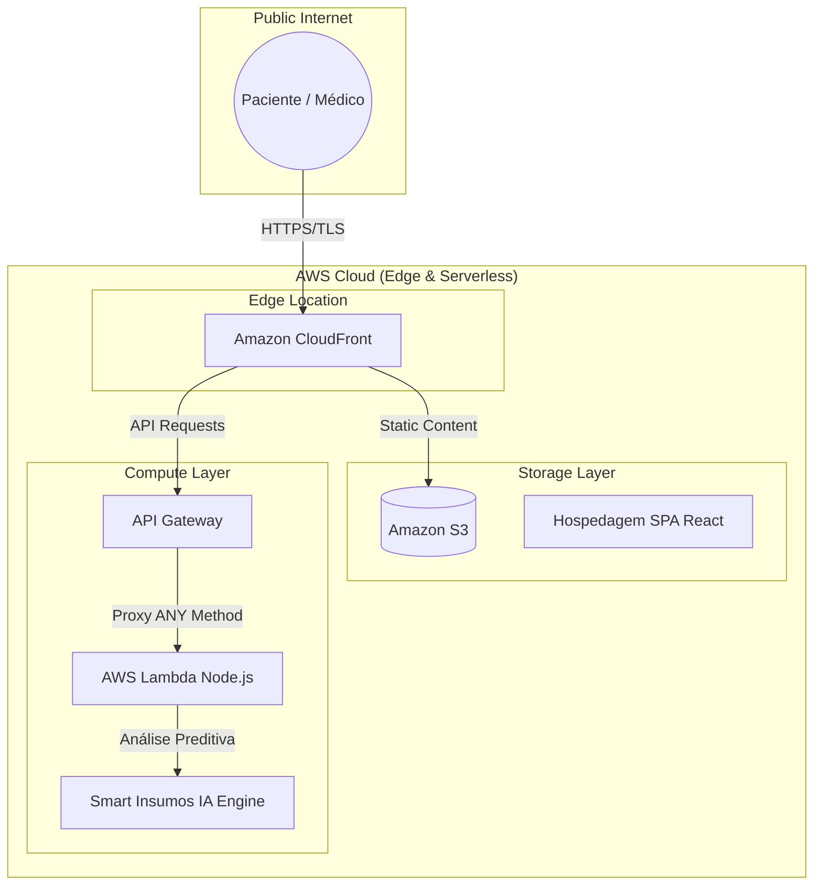
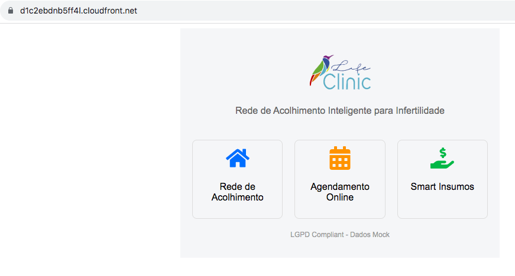
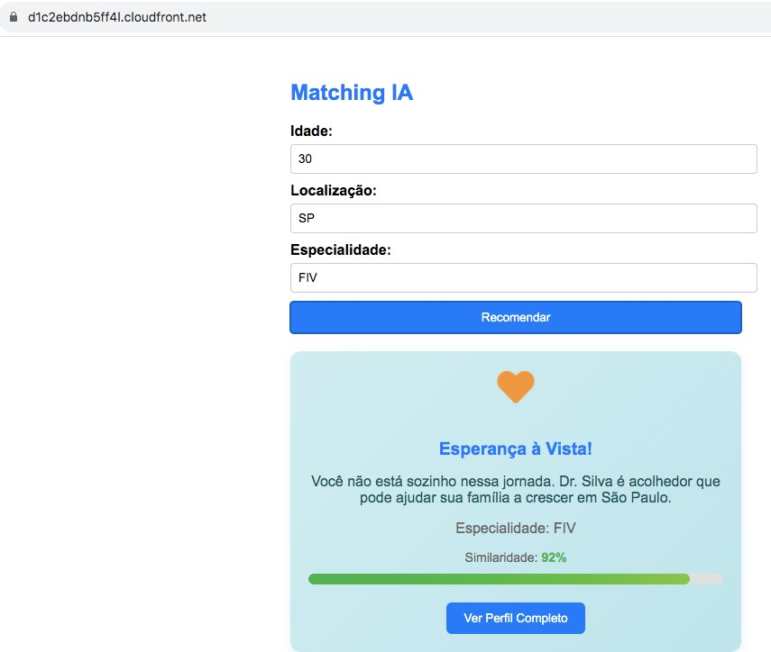
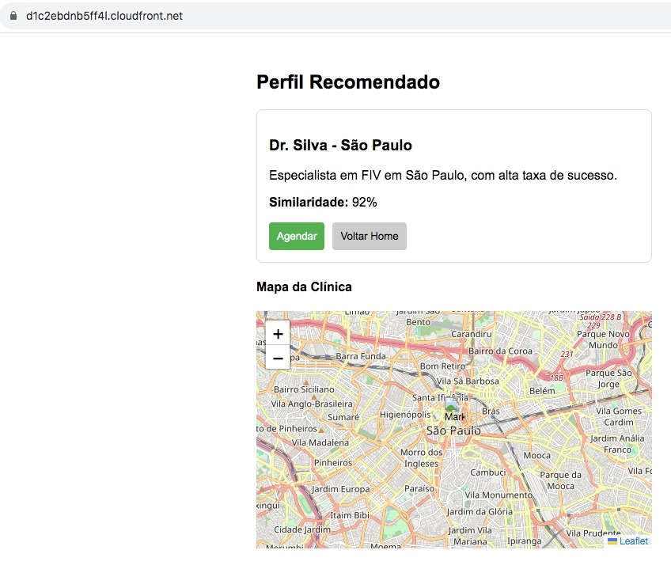
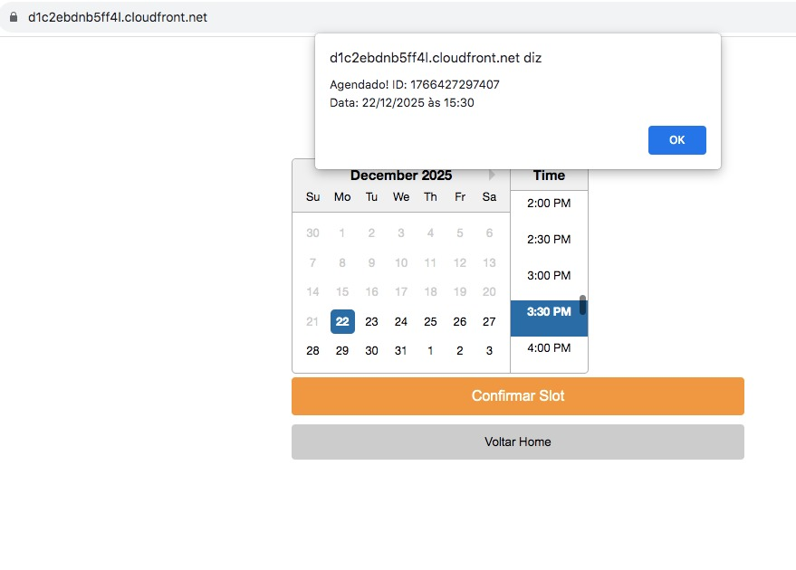
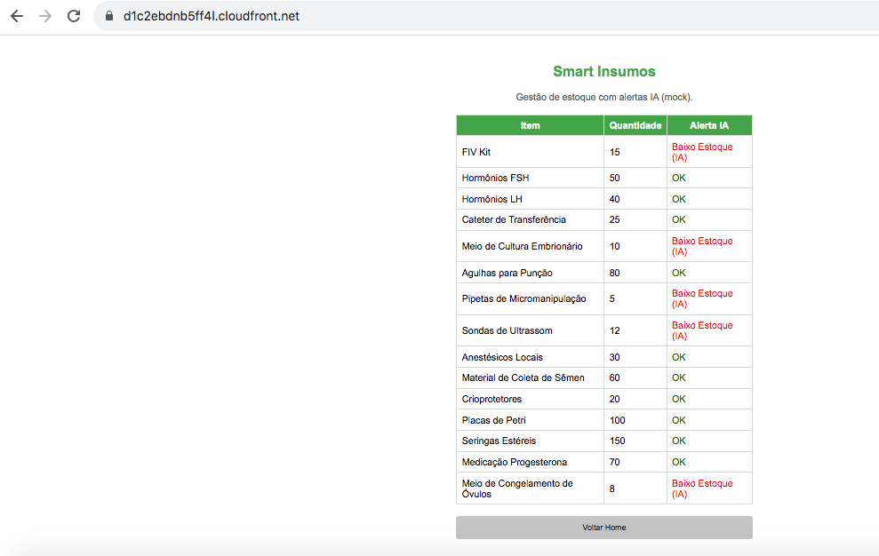

# 🏥 Life Clinic — Proof of Concept (POC)

Este repositório contém a Prova de Conceito (POC) da plataforma **Life Clinic**, desenvolvida para demonstrar uma arquitetura de alta fidelidade na **AWS**. O projeto foca em resolver a fragmentação na jornada de reprodução humana através de tecnologia **Serverless** e **Inteligência Artificial**.

## 🌐 Link da POC Viva
Acesse a aplicação rodando em ambiente produtivo:
👉 **[https://d1c2ebdnb5ff4l.cloudfront.net/](https://d1c2ebdnb5ff4l.cloudfront.net/)**

---

## 🚀 Arquitetura Geral da Solução

A solução prioriza o modelo **NoOps** e **FinOps**, garantindo escalabilidade infinita com custo operacional zero dentro do *AWS Free Tier*.

### 🏗️ Diagrama de Infraestrutura Cloud (IaC)


---

## 🧩 Diferenciais Técnicos demonstrados no Deploy

* **Smart Insumos (IA):** 🧠 Motor integrado que analisa o estoque e fornece alertas inteligentes via Lambda.
* **Segurança de Borda:** 🛡️ Implementação de **CloudFront** protegendo a origem S3, garantindo entrega via HTTPS.
* **Roteamento Unificado:** 🌐 Uso do método `ANY` no API Gateway para simplificar o roteamento e delegar o controle de CORS ao backend.
* **Automação Idempotente:** 🔄 Script `deploy.sh` robusto que realiza a limpeza de métodos, empacotamento de dependências e invalidação de cache automaticamente.

## 🛠 Tecnologias Utilizadas

| Camada | Tecnologia |
| --- | --- |
| **Frontend** | React (Build otimizado para produção) ⚛️ |
| **Backend** | Node.js 18.x (AWS Lambda) 🟢 |
| **IA Engine** | Lógica de análise preditiva integrada 🐍 |
| **Infraestrutura** | AWS CLI & Bash CI/CD Pipeline ☁️ |

## 📦 Como Executar

### ☁️ Deploy na AWS

O script automatizado cuida de todo o provisionamento, desde o S3 até a invalidação do CloudFront:

```bash
bash deploy.sh

```

### 💻 Desenvolvimento Local

```bash
# Frontend
cd frontend && npm install && npm start

# Backend
cd backend && node index.js

```

## 📊 Governança e Custos (FinOps)

A arquitetura foi desenhada para o modelo **Pay-as-you-go**:

* **Setup Inicial:** R$ 0,00 (100% elegível ao AWS Free Tier).
* **Provisionamento:** Roles IAM configuradas com o princípio de menor privilégio.
* **Escalabilidade:** Pronto para suportar picos de tráfego sem intervenção manual.


## ✅ Evidência de Sucesso (Deployment Audit)

Abaixo, o extrato do log de execução do pipeline de automação (`deploy.sh`), demonstrando o provisionamento bem-sucedido de ponta a ponta:

```text
[INFO] Deploy iniciado — Região: us-east-1
[INFO] [1/7] S3 Bucket Setup: lifeclinic-frontend-0242... [OK]
[INFO] [2/7] IAM Role: lifeclinic-poc-lambda-role [OK]
[INFO] [3/7] Lambda: manual-backend-function [UPDATED]
[INFO] [4/7] API Gateway: Configurando método ANY e Integrações Lambda... [OK]
[INFO] [5/7] Build frontend: Injetando API URL e Sincronizando S3... [OK]
[INFO] [6/7] CloudFront: Invalidação de cache iniciada... [OK]
[INFO] [7/7] Deploy finalizado com sucesso!
```












🚀 CloudFront URL: [https://d1c2ebdnb5ff4l.cloudfront.net/](https://d1c2ebdnb5ff4l.cloudfront.net/)

📡 API Endpoints: 
    /api/recomendar 
    /api/insumos
    /api/agendar

---

**Autor:** Weriston Castro Alves | Líder de Arquitetura de Soluções
