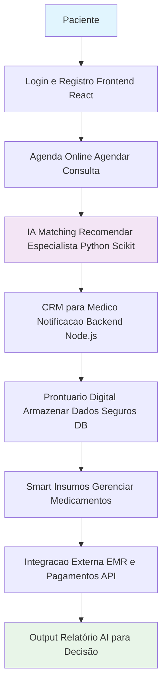
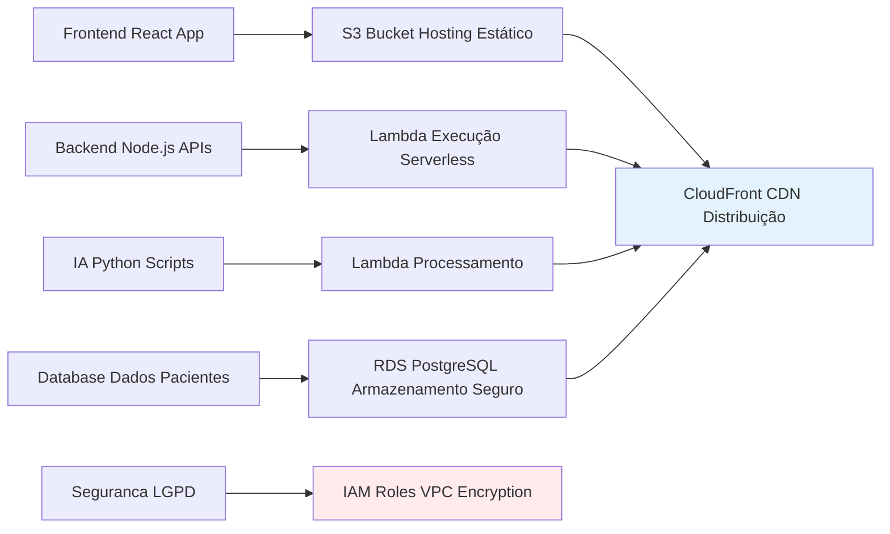

# Diagramas da Arquitetura - Life Clinic POC

## Diagrama de Contexto da Solução da Aplicação
Fluxo high-level da plataforma: Jornada do paciente, módulos (agenda, CRM, prontuario) e IA para matching de especialistas (alinhado ao PDF do desafio).

### Diagrama de Infraestrutura (AWS)
Arquitetura em cloud: Frontend no S3, Backend/IA no Lambda, DB no RDS, com seguranca LGPD.

